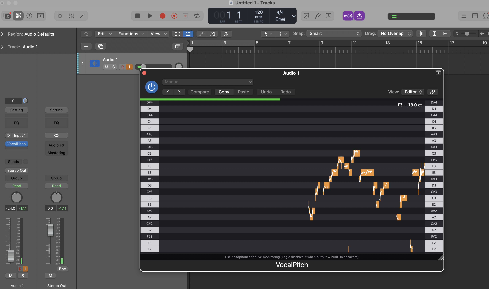

# VocalPitchMonitor

Small vibe coded pitch monitor for your DAW.

A macOS AU plugin that shows a scrolling real-time pitch trace against a piano keyboard, inspired by the mobile apps *Vocal Pitch Monitor* and *Nail the Pitch*. Drop it on a vocal track in Logic and you get a live note + cents readout plus a scrolling 12-second history.



## Build

Requires Xcode Command Line Tools and CMake (`brew install cmake`).

```bash
cmake -B build -G Xcode
cmake --build build --config Release
```

JUCE is pulled in automatically via CMake `FetchContent` (no manual install).

The build copies `VocalPitchMonitor.component` into `~/Library/Audio/Plug-Ins/Components/`. To force Logic / GarageBand to rescan:

```bash
killall -9 AudioComponentRegistrar
```

## Use

Instantiate as an audio-effect AU on a vocal track. Arm the track and enable input monitoring to see live pitch.

**Note:** Logic disables input monitoring of the built-in MacBook microphone whenever the output is set to the built-in speakers (feedback prevention). Use headphones — or any non-built-in output — for live monitoring.

## How it works

- YIN pitch detection (~2048-sample frame, 512-sample hop) on a downmixed mono input
- Lock-free FIFO from the audio thread to the UI
- 24-note viewport that smoothly auto-scrolls to follow the singer's pitch
